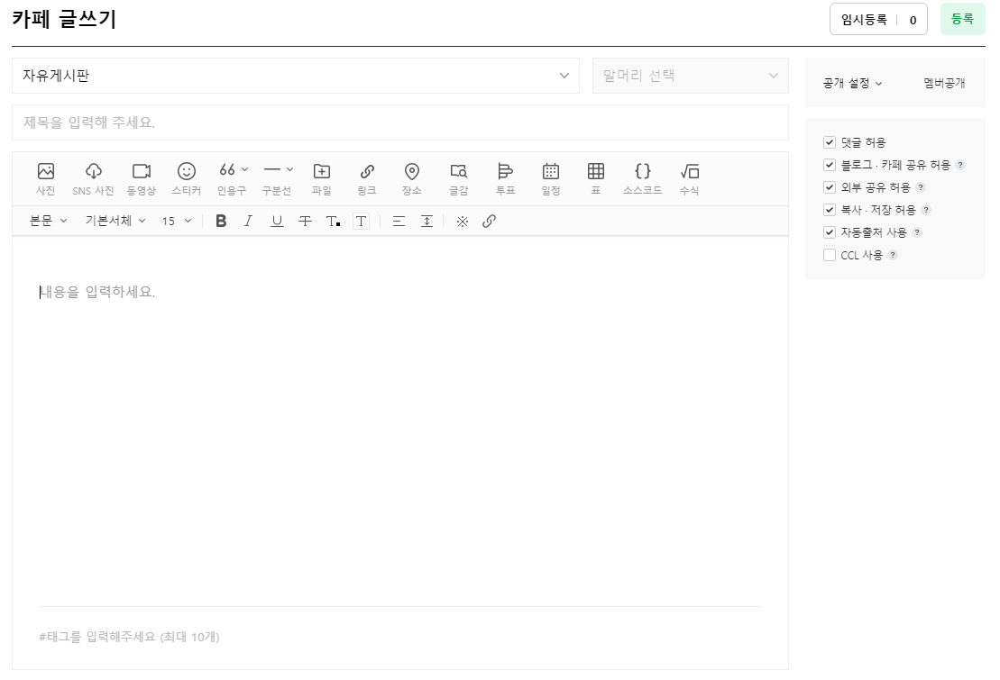
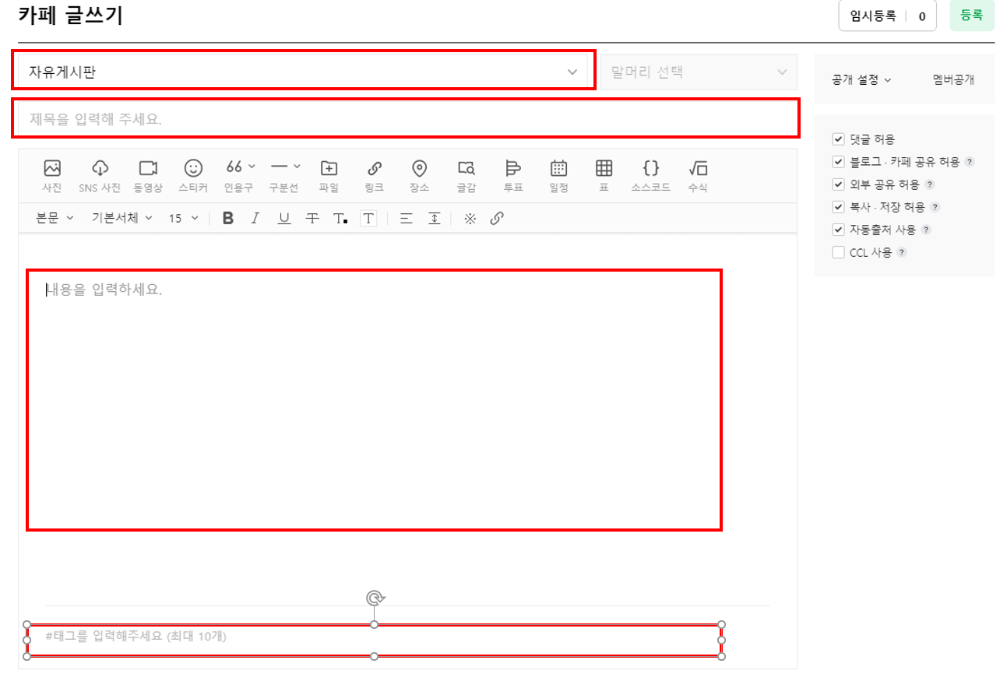
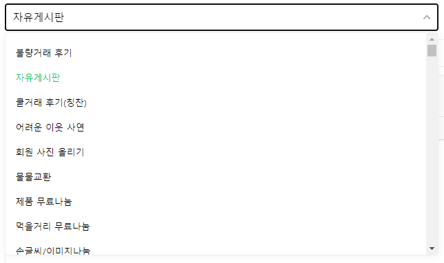
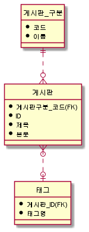
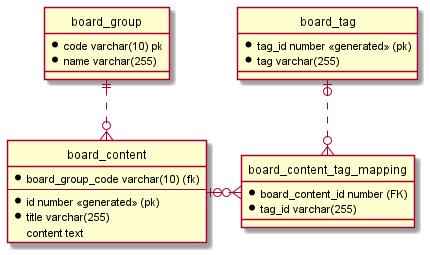
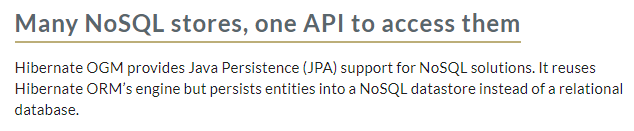

## 들어가며

개구리 올챙이적 기억못한다고 나의 경우는 잘 모르겠지만, 주변 동료 개발자들이 mybatis, jdbctemplate등으로 sql을 사용하며 개발을 했던 경험자들은 JPA로 넘어오면서 백이면 백 힘들어하는 모습을 보았다. 
대체 무엇이 그들을 힘들게 하는 것일까? 이전부터 정리해고 싶었던 글이였는데 키보드 앞에 섰다.
  
  
## 대체 무엇이 문제일까?

먼저 답만 생각해본다면 기존에 개발했던 경험들이다라고 생각해본다. 기존에 설계라고하면 db 스키마 설계를 떠올렸는데 jpa를 사용하면 설계는 객체 모델링이 된다. 사실 이 둘의 차이는 별거 아닌데 지도 같은거라 직진으로 금방 갈 수 있는데 결국에는 목적지에는 도달하지만 꾸불꾸불 긴 길을 오랜 시간을 들여 목적지에 돌아가는 것과 비슷한 느낌을 받는다.(또는 건물의 기초공사)

그럼 글로만 하면 이해가하기 어려우니 간단히 코드와 샘플들을 보여주면서 정리를해보겠다.

  

위의 이미지는 설계 단계에 대한 설명을 특정 서비스의 화면을 캡쳐해 보았다.

모든 요소들을 다루면 복잡해지니 이미지에서 (위에서부터 순서대로) 게시판 구분, 제목, 내용, 태그만 살펴보겠다.

참고로 게시판 구분의 selectbox를 펼쳐보면.

위와 같은 형태이다.

자 그럼 기존의 sqler들은 위와 같은 화면 기획이 나오면 무엇을 먼저할까?

대충 위와 같이 게시판 구분 테이블의 코드 1개를 N개 이상 가지는 게시판 테이블. 그리고 게시판과 연관된 태그 정보를 매핑할 패그 테이블을 떠올릴 것이다.

그리고 이것을 ERD로 그린다면 이렇게 작성할 듯 하다.

자 그럼 디비 설계를 했으니 create table ddl script를 만들고 이것을 dao 클래스를 만들고 db에서 넘어온 ResultSet을 담을 dto 객체를 만들것이다. 사고의 흐름이 db -> dao -> service -> controller 이런 흐름을 가던것이 보통이다.

자 그럼 JPA를 왜 쓰는 것일까? 바로 윗다넹 나온 db -> dao 레어어를 추상화해줘서 내가 sql을 전혀 몰라도 java만으로 db를 쓸 수 있게 도와주는 솔루션이다.

이 컨셉만 본다면 sql을 전혀 몰라도 된다.

그런데 sqler들은 jpa를 기존의 sql base로 jpa 기술을 접근하는데에서 어려움이 있다.

그것이 무엇이냐하면 sql로 짜면 join으로 심플한데 조인대신 N + 1이 발생한다던가 @OneToMany @ManyToOn 같은 어노테이션을 쓰면서 엔티티 설계도 뭔가 기존보다 어려운것 같고. `spring.jpa.generate-ddl`나 `spring.jpa.hibernate.ddl-auto` 이 옵션을 false로 두고 @Entity를 설계하고 이걸 create table을 직접 만드는 것이다. 그리고 `spring.jpa.show-sql`을 true로 걸고 모든 동작들의 sql을 확인해가며 sql의 동작을 검증하고 sql이 어떻게 나오는지 궁금증을 참지 못하는 것이다.

그래서 듣는 대표적인 말들이 `하이버네이트(또는 JPA)의 쿼리는 비효율적인 것 같아요.`인듯하다.

처음에는 나도 이 말에 동의를 했으나 시간이 지나면서 조금 생각이 달라졌다. 

세상의 모든 기술은 트레이드오프가 있다.
뭐 다른 말로는 등가교환이랄까?

아무튼 JPA란 기술이 왜 나왔고 이 기술을 왜 써야하는지 배경을 먼저 이해한다면 SQL과 단순 비교에 대한건 접근 방식이 틀리다는 것이다.

JPA를 써야하는 배경중에 혹자는 다양한 Dialect를 제공하기 때문에 mysql, mssql, oracle, h2... 등등 다양한 ANSI SQL이 아닌 limit, rownum 같은 특정 rdbms에만 있는 문법들에 대한 대응을 안해줘도 되서 편하다는 말을 하며 JPA를 극찬하는데 지금 시점에서 그 말은 그냥 syntax sugar같은 느낌일뿐 내가 생각하는 JPA의 본질은 `메모리에 있는 자바 객체를 영속화하고 싶다`가 아닐까 조심히 생각해본다.

`JPA`란 이름도 `Java Persistence API`인 것을 보면 아주 틀린말은 아닌것 같다.

그럼 여기서 영속(persistence)란 단어의 뜻을 살펴보면. 보통은 jvm의 힙메모리... 물리적으로는 RAM이라는 메모리에 있는 객체들은 영속이라는 단어를 쓰지 않는다. 다들 알다싶이 컴퓨터의 전원이 내려가면 날라가기때문에 휘발성이란 특성을 가진다. 그렇기 때문에 전원이 내려가도 유지되는 영속이란 특성을 갖기위해서는 SSD나 하드디스에 저장하는 것처럼 비휘발성 메모리에 저장을 하게 된다.

관계형데이터베이스(RDBMS)는 당연히 영속 데이터를 관리하므로 jpa의 persistence의 단어에 걸맞는 저장소이다.

그러면 rdbms뿐만 아니라 file, nosql, 기타등등 다른 영속데이터를 만들수 있는 다양한것들을 통해 저장할수 있는거 아닌가하는 생각을 할 수 있다.

이런 생각을 하게 된다면 스택오버플로우에서 [Does JPA only refer to RDBMS(JPA는 RDBMS만 가리킵니까)](https://stackoverflow.com/questions/7625799/does-jpa-only-refer-to-rdbms)라는 질문을 만날수 있다.

그렇다 나만 이렇게 생각하는게 아니라는 것이다.(또 한편으로는 이름을 약간 오해할 수 있게 짓기도 했다.)

참고로 여기 답글중에는 이런 내용들들도 있다. `JPA only defines standard mappings for relational data. But many JPA providers support non-relational data as well.` (JPA는 관계형 데이터 표준 매핑만 정의합니다. 하지만 많은 JPA 프로바이더들은 비관계형 데이터도 지원합니다.)

JPA 프로바이더들중에 그렇다고하니 한번 찾아보면

[hibernate ogm](https://hibernate.org/ogm/)이라는 프로젝트에 가보면 위와 같이 rdmbs가 아닌 nosql를 위한 jpa 솔루션을 제공하는 것을 볼 수 있다.

자... 그럼 persistence란 단어를 가지고 제법 길게 글을 이어 나갔는데.

그럼 이제 내가 하고 싶은 이야기는 `SQL이 익숙해서 그 마음을 알지만 JPA를 대할때는 JPA의 동작 방식에 대해서 학습하고 SQL은 잠시 멀어지세요`이다.

~~이 짤을 쓰기위해 글을 쓰기 시작했던건 아니다~~

자 그러므로 JPA에 

> 애들을 재워야해서 다음편에 중략... 

