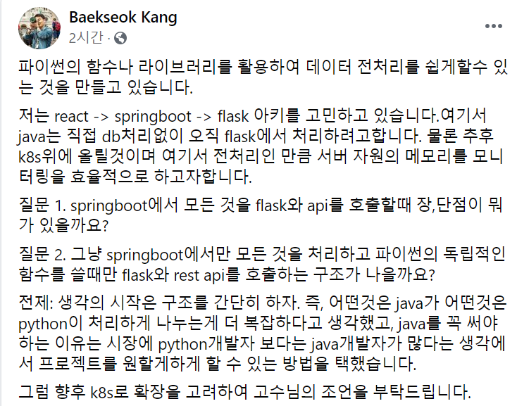

## 질문




## 답변

> 파이썬의 함수나 라이브러리를 활용하여 데이터 전처리를 쉽게할수 있는 것을 만들고 있습니다.

네 파이썬 판다스 같은게 데이터 처리하기 참 좋긴하더군요.

> 저는 react -> springboot -> flask 아키를 고민하고 있습니다.

여기 문맥에서 굳이 react를 언급하지 않으셔도 될 것 같은데. 글을 통해 대중적이며 모던한 기술셋을 지향하신다는 것을 느낄수 있네요.

> 여기서 java는 직접 db처리없이 오직 flask에서 처리하려고합니다. 

이런구조에서는 혹자는 이렇게 부르더라고요 기존에 자바를 백엔드라고 불렀던것을

```
| front      |      backend     |
react ----- java ------ database 


|      front    |          backend         |
react ----- java ------ flask ----- database
```

제가 java로 servlet으로 프로그램을 만들더라도 view engine으로 view layer를 만들어서 저보고 프론트 개발한거라고하더군요

암튼 이런 맥락에서 말씀하신 아키텍처는 flask 개발하는 사람은 핵심 도메인을 가져가고 java 개발자는 front가 사용할 api만 뽑아주는 역할을 원하시는 것 같습니다.

개발자 수급때문에 그렇다고는 하시는데 이정도는 그냥 신입 데려다가 트레이닝 시켜도 어렵지 않게 할수 있지않을까하는 생각이 듭니다. 굳이 고급 자바 개발자를 데려다 쓸 이유가 없다고 생각합니다.


근데 신입을 트레이닝 시킨다는 전제가 들어간다면 그냥 python으로 만들고 말지란 생각으로 연결이 되네요... 

>  물론 추후 k8s위에 올릴것이며 여기서 전처리인 만큼 서버 자원의 메모리를 모니터링을 효율적으로 하고자합니다.

k8s에 올리는거랑 질문과의 맥락의 연관성을 잘 모르겠지만 일단 모던한 아키텍처와 인프라 구성을 희망한다고 생각하신다고 생각이 듭니다. 서버자원의 메모리 모니터링 효율이란 말씀이 뭔가 생각해두신게 있으신 것 같은데 거기까지는 생각이 닿지 않네요.

> 질문 1. springboot에서 모든 것을 flask와 api를 호출할때 장,단점이 뭐가 있을까요?

장점
- 개발자 수급이 상대적으로 편하다?
- 숙련된 자바 개발자의 경우 서비스에 좀더 안정감을 얻을 수 있다.(대신 몸값이 비싸겠죠.)

단점
- 기술스택의 단일화에서 오는 장점을 잃게 된다.(개발속도, 운영)
- 레이어가 더 늘어나면서 개발시나 장애 대응시 더 어렵다.
- 자바 개발자가 개발이 재미 없어한다.


> 질문 2. 그냥 springboot에서만 모든 것을 처리하고 파이썬의 독립적인 함수를 쓸때만 flask와 rest api를 호출하는 구조가 나을까요?

파이썬의 독립적인 함수라는게 잘 이해가 가지 않지만 아마도 자바로 못만드는 부분인것 같네요.

개인적으로는 팀의 역량에 따라 결정하는게 맞다고 보여지고요. 질문1은 flask영역이 persistence 정보를 쥐고 있고 springboot는 필요할때마다 api로 호출하는 구조이고. 질문2는 springboot도 db를 쓰고 flask도 디비를 쓰는 상황이라고 보여지는데. 전자는 flask쪽에 업무가 늘어나는 단점이 있는 대비 springboot쪽 개발자는 추상화가 이뤄져서 상대적으로 개발이 단순해질것이고. 후자는 springboot쪽이 전자에 비해 복잡해 지겠죠.

개인적으로는 통일성을 추구하는 스타일이라 정확히 상황을 봐야하겠지만 저는 전자 스타일을 좋아하긴하는데 얼마나 일이 늘어날지 스코프를 살펴봐야겠네요(진리의 케바케네요..)

> 전제: 생각의 시작은 구조를 간단히 하자. 즉, 어떤것은 java가 어떤것은 python이 처리하게 나누는게 더 복잡하다고 생각했고, java를 꼭 써야하는 이유는 시장에 python개발자 보다는 java개발자가 많다는 생각에서 프로젝트를 원할게하게 할 수 있는 방법을 택했습니다.

개인적으로는 python으로 시작해서 python으로 쭉하는걸 추천드립니다.
정말 나중에 나중에~ 시스템이 잘되고 복잡해지면 그때 자바 도입을 검토하시는게 절차인것 같습니다. 
처음부터 이 시스템 잘될거기 때문에 이런 아키로 갈거야해서 복잡하게 해봤자 잘된적이 없더군요. (제가 어느정도의 규모로 고민하시는지 알 수는 없지만)정말 최소가 뭔지 생각해보시고 범위를 결정하시면 될 것 같습니다.


> 그럼 향후 k8s로 확장을 고려하여 고수님의 조언을 부탁드립니다.

(죄송하게도 고수는 아니지만 글을 써보면...)
처음부터 cloud native하게 아키텍처를 설계하시고 무슨 사이드카 패턴이니 envoy니하는 k8s용으로 만들어진 녀석들을 붙여서 개발을 시작하는거 아니면

보통은 ec2이거나 온프레미스 환경에서 개발했을거고... 이걸 그대로 k8s로 넘기는건 그냥 aws에서 ec2 쓰는거랑 큰 차이 없다고 생각합니다. 그냥 배포 편해지고 스케일 인아웃이 편하다 정도인데. 흠... 요즘같은 클라우드 서비스가 잘 나와있는 환경에서 k8s가 그렇게 큰 도움이 될까(?)하는 생각이 있긴합니다.(k8s 운영 인력도 필요하고...)

그리고 k8s 고민하신다면 처음부터 k8s로 하셔도 되지 않을까요? gcp에서 k8s 써보니 너무 쉽더군요. aws 같은 경우는 도커만 쓸거면 ecs만 써도 충분해보이고요. k8s로는 eks로 바로 가셔도 될 것 같긴한데 이건 제가 못써봐서 말씀을 쉽게 할 수 없네요.

암튼 k8s 얘기를 정리하면 기존 온프레미스 환경을 쿠버네티스를 쓴다고해서 크게 다를게 없다. 어짜피 linux이고 docker에 말아 올려서 배포한다 정도인데. 초반 아키설계를 온프레미스 기준으로 하시고 동시에 k8s 특성에 맞게 뭔가 추가해야할 마법을 찾으시는거면 제 개인적으로는 특별히 없다는 생각이 듭니다.

--- 

좀 말씀하신 내용에 반대하는 성향의 내용을 쓰게 되었는데 제 개인적인 판단일뿐 이런 사람의 생각도 있구나정도만 참고하시면 될 것 같습니다.

감사합니다.